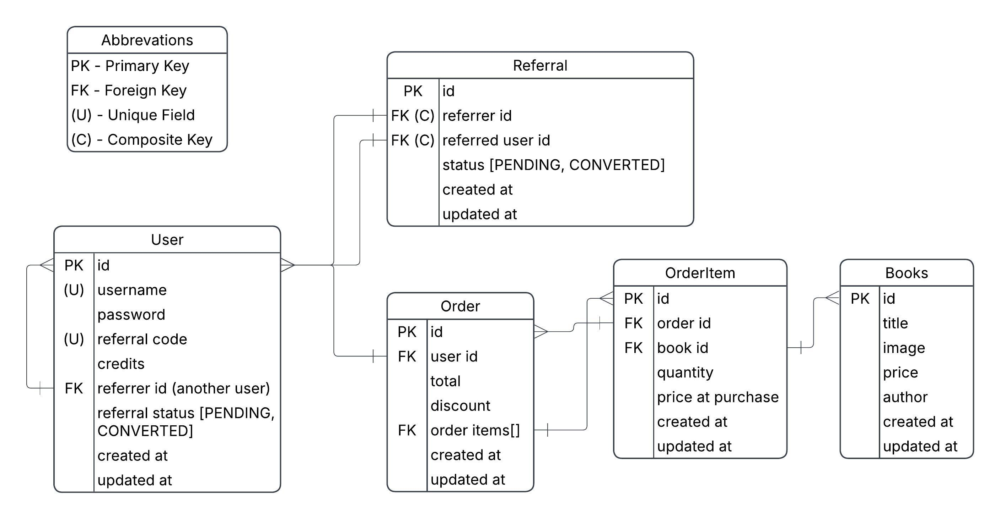
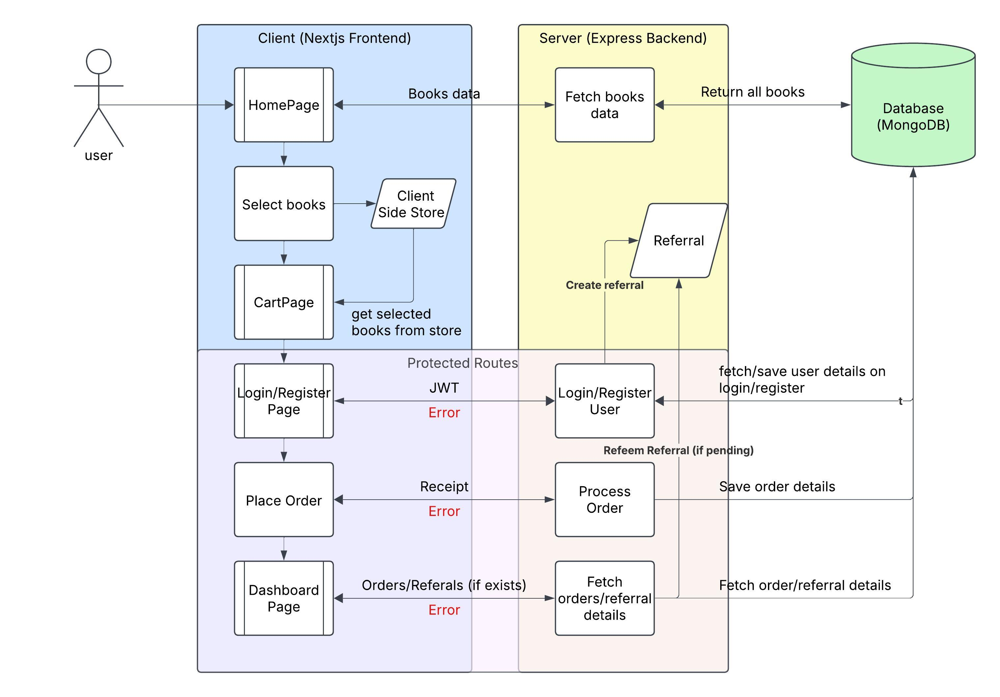

# Book Bay


**Book Bay** is a digital e-book marketplace designed to showcase a complete, end-to-end referral and credit system. Its like Ebay but for books. This project was built to demonstrate proficiency in full-stack development, from system design and architecture to creating a polished, responsive, and user-friendly interface.

The core feature is a referral program where users can share a unique link, track their referral activity, and earn credits. When a new user signs up via a referral link and makes their first purchase, both the referrer and the new user are rewarded with credits, fostering a viral growth loop.

### Core Features:

*   **Secure User Authentication**: Safe and secure user registration, login, and session management.
*   **Unique Referral Link Generation**: Every user receives a unique, shareable referral link upon registration.
*   **Referral Tracking**: The system meticulously tracks the relationship between referrers and referred users, from sign-up to conversion.
*   **Automated Credit System**: Both the referrer and the referred user automatically earn 2 credits upon the referred user's first successful purchase. The system prevents duplicate credit awards.
*   **Purchase Simulation**: A seamless "Buy Now" flow that simulates a real-world e-commerce transaction.
*   **Interactive User Dashboard**: A central hub for users to monitor their referral statistics, credits, their referral link and a list of all their orders.

---

## Architecture

## Database Entity Relationship diagram


* **User**: Each user is unique and stores the usual fiels like username, id etc, but also referralCode, credits and the user who referred them. We also store referral status to quickly check if their refer bonus is pending and dont have to make an extra request.
* **Book**: Stores basic info about each book product.
* **Referral**: An obejct we create whenever a user signs up through a referral. Its for tracking and crediting the bonus from referrals.
* **Order**: Contains details about the order, the user who placed the order, order items as well as discount.
* **OrderItem**: For tracking the items and their quantiy in an order. Stored separately so that there is space for marking each order item as delivered/cancelled/delayed etc incase that happens, just like how real shopping platforms work.

## Flow Diagram


* The user lands on the Homepage and can browse books.
* When they pick books to buy, the selections are stored in a small client-side store (I used Zustand for this).
* If the user tries to place an order but isn’t logged in, they are taken to the Login/Register page.
* After logging in or registering (with or without a referral code), the backend sends back a JWT, which the frontend uses for all protected routes. If the user signs up with a referral code, we also create a referral object and store other relevant info in the database at this step.
* On placing the first order, the backend checks if the user was referred by someone (from user.referralStatus, so we dont have to make an extra request) and, if the bonus is still pending, it credits both users and marks the referral as converted.
* The Dashboard shows the user’s orders, referral stats, and credits by fetching the data from the backend.


---

## Technical Stack & Architecture

This project is built with a modern, scalable, and maintainable architecture, adhering to best practices in web development.

*   **Frontend**: **Next.js (App Router)**, **TypeScript**, and **Tailwind CSS**. The UI is crafted from scratch without pre-built component libraries.
*   **State Management**: **Zustand** is used for efficient, minimal, and boilerplate-free global state management, handling the user session and shopping cart.
*   **Backend**: **Node.js** and **Express.js** with **TypeScript** provide a robust, type-safe RESTful API. The architecture is modular, separating concerns for scalability and maintainability.
*   **Database**: **MongoDB** with **Mongoose** for flexible and scalable data modeling. Schemas are carefully designed to ensure data integrity and efficient querying for users, books, orders, and referrals.
*   **Validation**: **Zod** is used for robust, end-to-end type-safe validation on both the client and server, ensuring data integrity from form inputs to the database.
*   **Security**: Passwords are encrypted using **bcrypt**. Persistent authentication is managed with **JWTs** stored in client-side localStorage. Environment variables are handled via a `.env` file to keep secrets out of the codebase.
*   **Code Quality**: The codebase is fully typed with TypeScript, follows a modular structure, and uses ESLint to enforce a consistent and clean coding style. The TyepScript types are completely consistent between frontend and backend.

---

## System Design

The application is designed with a clear separation between the client and server, communicating via a RESTful API.

1.  **User Authentication**: A new user registers, and their credentials are securely hashed and stored in MongoDB. A JWT is generated and sent to the client as a secure, HTTP-only cookie.
2.  **Referral Link**: Once logged in, the user's dashboard displays a unique referral code. The frontend constructs a shareable link (e.g., `https://yourapp.com/register?r=CODE123`).
3.  **Referral Sign-up**: A new user signs up using the referral link. The referral code is captured from the URL query parameters and stored with the new user's record, establishing the referrer-referred relationship.
4.  **First Purchase & Credit Award**: When the referred user completes their first purchase, the backend API verifies it's their first order. If so, it atomically updates the credit balance for both the referrer and the referred user, ensuring no double-crediting can occur.
5.  **Dashboard**: The dashboard fetches data from separate API endpoints to display the user's credit balance, referral link, and aggregated referral statistics (total referrals and conversions).

---

## Getting Started

Follow these instructions to set up and run the project locally.

### Prerequisites

*   Node.js (v18.x or later)
*   pnpm (or npm/yarn)
*   MongoDB instance (local or cloud-based like MongoDB Atlas)
*   A running instance of the backend server.

### 1. Clone the Repository

```bash
git clone <this-repo-url>
cd book-bay-frontend
```

### 2. Install Dependencies

```bash
pnpm install
```

### 3. Set Up Environment Variables

Create a `.env.local` file in the root of the project and add the following variables. A `.env.example` file is provided for reference.

```env
# .env.local

# The URL of your backend API server
NEXT_PUBLIC_API_URL=http://localhost:4000
```

### 4. Run the Development Server

```bash
pnpm dev
```

Open http://localhost:3000 in your browser to see the application.

---

## API Overview

The frontend interacts with a separate Express backend through a set of REST API endpoints.  
Below is a quick overview of the main routes used in the app:

- **POST `/api/users/register`**  
  Registers a new user. A `referralCode` can be provided during sign-up.

- **POST `/api/users/login`**  
  Logs in a user and returns a JWT used for authentication.

- **GET `/api/users/me`** *(Requires JWT)*  
  Fetches the profile details of the currently logged-in user.

- **GET `/api/books`**  
  Retrieves all available books to display in the store.

- **POST `/api/orders`** *(Requires JWT)*  
  Creates a new order. If it's the user’s first order, referral credits are applied automatically.

- **GET `/api/orders`** *(Requires JWT)*  
  Returns all orders for the authenticated user.

- **GET `/api/referrals/stats/:userId`**  
  Returns referral statistics for a user (total sign-ups and conversions).

For detailed request/response examples and the full Postman collection, please refer to the **backend repository**.


## Key Achievements & Engineering Decisions

*   **Clean Architecture**: The frontend is structured logically with a clear separation of components, stores, and utility functions, promoting maintainability and scalability.
*   **Type Safety**: Full TypeScript adoption with Zod for schema validation ensures data integrity from the API boundary to the UI, reducing runtime errors.
*   **Efficient State Management**: Zustand provides a lightweight and intuitive solution for managing global state (user session, cart) without being as heavy as something like Redux.
*   **Caching & Performance**: Next.js App Router is used for optimized rendering. Data fetching strategies like `revalidate` are employed to balance between fresh and cached data.
*   **Data Integrity**: The backend is designed to handle concurrent requests and prevent race conditions, such as double-crediting, by making database updates atomic where necessary.
*   **Modern & Responsive UI**: The user interface is built from the ground up with Tailwind CSS, ensuring a unique, modern, and fully responsive experience across all devices.
